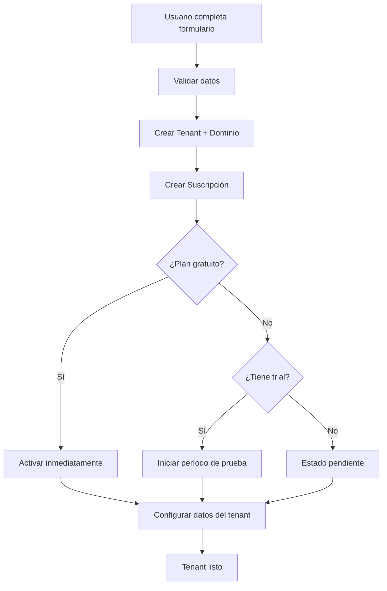
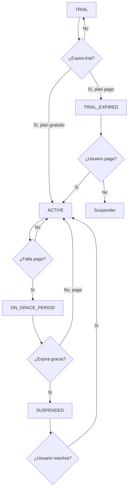

# Sistema de Suscripciones con MercadoPago

Un sistema completo de gestión de suscripciones multi-tenant integrado con MercadoPago, que incluye períodos de prueba, períodos de gracia, notificaciones automáticas y control granular de funcionalidades.

## 📋 Tabla de Contenidos

- [Características](#-características)
- [Instalación](#-instalación)
- [Configuración](#-configuración)
- [Flujo del Sistema](#-flujo-del-sistema)
- [Comandos Disponibles](#-comandos-disponibles)
- [Estados de Suscripción](#-estados-de-suscripción)
- [Uso en Código](#-uso-en-código)
- [Testing](#-testing)
- [Troubleshooting](#-troubleshooting)

## 🚀 Características

### Backend

- ✅ **Gestión completa del ciclo de vida** de suscripciones
- ✅ **Integración robusta con MercadoPago** (webhooks seguros)
- ✅ **Períodos de prueba** automáticos
- ✅ **Períodos de gracia** para pagos fallidos
- ✅ **Notificaciones por email** automáticas
- ✅ **Control de límites por plan** (profesionales, servicios, etc.)
- ✅ **Middleware de autorización** granular
- ✅ **Comandos de mantenimiento** automático

### Frontend

- ✅ **Interfaz completa** de gestión de suscripciones
- ✅ **Notificaciones en tiempo real** en la UI
- ✅ **Selección y cambio de planes** dinámico
- ✅ **Estados visuales** claros y informativos
- ✅ **Hooks React** para verificar límites

## 📦 Instalación

### 1. Migraciones

```bash
# Ejecutar todas las migraciones
php artisan migrate

# Migración específica para suscripciones
php artisan migrate --path=database/migrations/2025_06_12_125628_create_subscriptions_table.php
```

### 2. Registrar Providers

```php
// config/app.php
'providers' => [
    // ... otros providers
    App\Providers\SubscriptionServiceProvider::class,
    App\Providers\EventServiceProvider::class,
],
```

### 3. Configurar Variables de Entorno

```bash
# .env
# MercadoPago
MP_ACCESS_TOKEN=your_mercadopago_access_token
MP_WEBHOOK_SECRET=your_webhook_secret_for_validation
MP_PREAPPROVAL_URL=https://api.mercadopago.com/preapproval
MP_PAYMENT_URL=https://api.mercadopago.com/v1/payments
MP_DEFAULT_CURRENCY=CLP

# Configuración de Suscripciones
SUBSCRIPTION_REMINDER_DAYS=3
SUBSCRIPTION_DUE_REMINDER_DAYS=1
SUBSCRIPTION_GRACE_PERIOD_DAYS=7
SUBSCRIPTION_AUTO_SUSPEND_DAYS=30
SUBSCRIPTION_MAX_FAILED_ATTEMPTS=3

# Queues (recomendado para emails)
QUEUE_CONNECTION=database
MAIL_QUEUE=emails
```

### 4. Configurar Límites de Planes

```bash
# Editar config/subscription.php
# Reemplazar los UUIDs de ejemplo con los IDs reales de tus planes
```

### 5. Configurar Cron Jobs

```bash
# Agregar a crontab
* * * * * cd /path/to/your/project && php artisan schedule:run >> /dev/null 2>&1
```

### 6. Configurar Queues (Opcional pero Recomendado)

```bash
# Crear tabla de jobs
php artisan queue:table
php artisan migrate

# Ejecutar worker (en producción usar supervisor)
php artisan queue:work --queue=emails
```

## ⚙️ Configuración

### Configuración de Límites por Plan

Edita `config/subscription.php` para definir los límites de cada plan:

```php
'plan_limits' => [
    'uuid-del-plan-starter' => [
        'max_professionals' => 3,
        'max_services' => 15,
        'max_bookings_per_month' => 200,
        'advanced_reports' => false,
        'custom_branding' => false,
    ],
    'uuid-del-plan-pro' => [
        'max_professionals' => 10,
        'max_services' => 50,
        'max_bookings_per_month' => 1000,
        'advanced_reports' => true,
        'custom_branding' => true,
    ],
],
```

### Webhook de MercadoPago

Configura en tu panel de MercadoPago:

- **URL:** `https://tudominio.com/webhook/mercadopago`
- **Eventos:** `preapproval`

## 🔄 Flujo del Sistema

### 1. Creación de Tenant



### 2. Ciclo de Vida de Suscripción



### 3. Notificaciones Automáticas

- **Trial expirando:** 3 días antes (configurable)
- **Gracia expirando:** 2 días antes
- **Pago fallido:** Inmediatamente
- **Suscripción activada:** Al confirmar pago

## 🛠 Comandos Disponibles

### Gestión Automática

```bash
# Comando principal - ejecuta diariamente vía cron
php artisan subscriptions:manage-lifecycle
```

**¿Qué hace?**

- Expira trials vencidos
- Suspende cuentas con gracia expirada
- Envía notificaciones de expiración próxima
- Actualiza estados automáticamente

### Setup y Testing

```bash
# Crear datos de prueba completos
php artisan subscription:setup-test-data

# Crear datos y resetear existentes
php artisan subscription:setup-test-data --reset

# Verificar estado del sistema
php artisan subscription:check-system
```

### Testing de Flujos

```bash
# Simular expiración de trial
php artisan subscription:test-flow trial-expire

# Simular expiración de período de gracia
php artisan subscription:test-flow grace-expire

# Simular fallo de pago
php artisan subscription:test-flow payment-fail
```

### Sincronización y Mantenimiento

```bash
# Sincronizar con MercadoPago
php artisan subscriptions:sync-mercadopago

# Limpiar tenants huérfanos (sin suscripción o setup fallido)
php artisan tenants:cleanup-orphans --dry-run
php artisan tenants:cleanup-orphans

# Comando obsoleto (reemplazado por manage-lifecycle)
php artisan subscriptions:prune-grace-periods
```

### Información y Debug

```bash
# Ver estado de suscripciones
php artisan subscription:check-system

# Inspeccionar tenant específico
php artisan tinker
>>> $tenant = Tenant::find('tenant-id');
>>> $subscription = $tenant->subscriptions()->first();
>>> $subscription->getStatusMessage();
```

## 📊 Estados de Suscripción

| Estado            | Descripción                     | Puede Acceder | Acciones Disponibles   |
| ----------------- | ------------------------------- | ------------- | ---------------------- |
| `ACTIVE`          | Suscripción activa y al día     | ✅ Sí         | Cancelar, cambiar plan |
| `TRIAL`           | En período de prueba            | ✅ Sí         | Suscribirse, cancelar  |
| `TRIAL_EXPIRED`   | Prueba expirada                 | ❌ No         | Suscribirse            |
| `ON_GRACE_PERIOD` | Pago fallido, en gracia         | ✅ Sí         | Actualizar pago        |
| `SUSPENDED`       | Suspendida por falta de pago    | ❌ No         | Reactivar              |
| `CANCELLED`       | Cancelada por usuario           | ❌ No         | Reactivar              |
| `PENDING`         | Esperando configuración de pago | ❌ No         | Configurar pago        |
| `PAUSED`          | Pausada por MercadoPago         | ❌ No         | Contactar soporte      |

## 💻 Uso en Código

### Backend - Verificar Límites

```php
use App\Helpers\SubscriptionHelper;

// En controladores
public function store(Request $request)
{
    $currentCount = Professional::count();

    if (!SubscriptionHelper::checkLimit('max_professionals', $currentCount)) {
        $remaining = SubscriptionHelper::getRemainingCount('max_professionals', $currentCount);
        return back()->withErrors([
            'error' => "Límite alcanzado. Puedes agregar {$remaining} profesionales más."
        ]);
    }

    // Continuar con la creación...
}

// Verificar funcionalidades
if (!SubscriptionHelper::canAccessFeature('advanced_reports')) {
    return redirect()->route('tenant.subscription.index')
        ->with('error', 'Esta función requiere un plan superior.');
}
```

### Backend - Middleware en Rutas

```php
// routes/tenants/professionals.php
Route::post('/professionals', [ProfessionalController::class, 'store'])
    ->middleware([
        'auth',
        CheckSubscription::class,  // Verificar suscripción activa
        CheckFeatureLimit::class . ':max_professionals'  // Verificar límite específico
    ]);
```

### Frontend - Hook React

```tsx
import { useSubscriptionLimits } from '@/hooks/use-subscription-limits';

function ProfessionalsPage() {
    const { checkLimit, getRemainingCount, hasFeature, needsUpgrade, subscription } = useSubscriptionLimits();

    const currentProfessionals = professionals.length;
    const canAddMore = checkLimit('max_professionals', currentProfessionals);
    const remaining = getRemainingCount('max_professionals', currentProfessionals);

    if (needsUpgrade()) {
        return <UpgradePrompt />;
    }

    return (
        <div>
            <h1>Profesionales ({currentProfessionals})</h1>

            {!canAddMore && (
                <Alert>
                    Has alcanzado el límite de tu plan.
                    <Link href="/subscription">Actualizar plan</Link>
                </Alert>
            )}

            <Button disabled={!canAddMore} onClick={handleAdd}>
                Agregar Profesional {remaining > 0 && `(${remaining} restantes)`}
            </Button>

            {hasFeature('advanced_reports') && <AdvancedReportsSection />}
        </div>
    );
}
```

### Frontend - Componente de Estado

```tsx
// El banner se muestra automáticamente según el estado
import { SubscriptionBanner } from '@/components/subscription-banner';

// En tu layout principal:
{
    subscription && <SubscriptionBanner subscription={subscription} />;
}
```

## 🧪 Testing

### Configuración de Testing

```bash
# 1. Crear datos de prueba
php artisan subscription:setup-test-data

# 2. Verificar que todo funciona
php artisan subscription:check-system

# 3. Probar flujos específicos
php artisan subscription:test-flow trial-expire
```

### Datos de Prueba Creados

El comando `setup-test-data` crea:

| Tenant        | Estado             | Dominio                   | Descripción                    |
| ------------- | ------------------ | ------------------------- | ------------------------------ |
| `free-demo`   | Plan Gratuito      | free-demo.tudominio.com   | Suscripción gratuita activa    |
| `trial-demo`  | Trial (3 días)     | trial-demo.tudominio.com  | Período de prueba expirando    |
| `grace-demo`  | Período de Gracia  | grace-demo.tudominio.com  | Pago fallido, 2 días restantes |
| `active-demo` | Suscripción Activa | active-demo.tudominio.com | Plan pago activo y al día      |

### Tests Unitarios

```php
// tests/Feature/SubscriptionFlowTest.php
public function test_trial_subscription_expires_correctly()
{
    $subscription = Subscription::factory()->trial()->create([
        'trial_ends_at' => now()->subDay()
    ]);

    $this->artisan('subscriptions:manage-lifecycle');

    $subscription->refresh();
    $this->assertEquals(SubscriptionStatus::TRIAL_EXPIRED, $subscription->status);
}
```

## 🔧 Troubleshooting

### Problemas Comunes

#### 1. Error de transacción al crear tenant

```bash
# Problema: CREATE DATABASE cannot run inside a transaction block
# Solución: El código ya maneja esto correctamente
# Verificar que uses la versión corregida del TenantController
```

#### 2. Webhooks no funcionan

```bash
# Verificar configuración
php artisan subscription:check-system

# Verificar que la URL esté configurada en MercadoPago
# URL: https://tudominio.com/webhook/mercadopago

# Verificar logs
tail -f storage/logs/laravel.log | grep webhook
```

#### 3. Emails no se envían

```bash
# Verificar configuración de mail
php artisan config:cache

# Si usas queues, verificar que estén funcionando
php artisan queue:work --queue=emails

# Verificar logs de mail
tail -f storage/logs/laravel.log | grep mail
```

#### 4. Límites no se respetan

```bash
# Verificar configuración de límites
php artisan config:cache

# Verificar que los UUIDs de planes sean correctos
php artisan tinker
>>> Plan::all()->pluck('name', 'id');
```

### Logs Importantes

```bash
# Logs de suscripciones
tail -f storage/logs/laravel.log | grep -i subscription

# Logs de MercadoPago
tail -f storage/logs/laravel.log | grep -i mercadopago

# Logs de tenants
tail -f storage/logs/laravel.log | grep -i tenant
```

### Verificación Manual

```php
// En tinker
php artisan tinker

// Verificar tenant
>>> $tenant = Tenant::find('tenant-id');
>>> $subscription = $tenant->subscriptions()->first();
>>> $subscription->canAccess();  // ¿Puede acceder?
>>> $subscription->getStatusMessage();  // Estado legible

// Verificar límites
>>> App\Helpers\SubscriptionHelper::getFeatureLimits();
>>> App\Helpers\SubscriptionHelper::checkLimit('max_professionals', 5);
```

## 📈 Monitoreo en Producción

### Métricas Importantes

```bash
# Ejecutar diariamente para monitoreo
php artisan subscription:check-system

# Verificar suscripciones que expiran pronto
# (implementar comando personalizado si necesitas métricas específicas)
```

### Alertas Recomendadas

- 🚨 **Alto:** Más del 10% de suscripciones en período de gracia
- ⚠️ **Medio:** Trials expirando sin conversión
- 📊 **Info:** Nuevas suscripciones creadas

### Mantenimiento Regular

```bash
# Limpiar tenants huérfanos (semanal)
php artisan tenants:cleanup-orphans

# Sincronizar con MercadoPago (si hay discrepancias)
php artisan subscriptions:sync-mercadopago

# Verificar estado general (diario)
php artisan subscription:check-system
```

---

## 📞 Soporte

Para problemas específicos:

1. Revisar logs: `storage/logs/laravel.log`
2. Ejecutar: `php artisan subscription:check-system`
3. Verificar configuración: variables de entorno y config/subscription.php

El sistema está diseñado para ser robusto y auto-gestionado. Los comandos automáticos manejan la mayoría de situaciones sin intervención manual.
